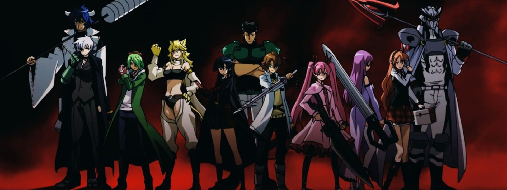

# Akame ga Kill

<!-- HERO:START -->

{ .hero-img }

<!-- HERO:END -->

=== "Spotify"
    <iframe style="border-radius:12px"
      src="https://open.spotify.com/embed/playlist/0PQaPZdehXQroU5FgDBThj"
      width="100%" height="352" frameborder="0"
      allow="autoplay; clipboard-write; encrypted-media; fullscreen; picture-in-picture"
      loading="lazy"></iframe>

    [▶ Abrir en Spotify](https://open.spotify.com/playlist/0PQaPZdehXQroU5FgDBThj)

=== "YouTube"
    *(pendiente: añade el link de YouTube a esta playlist)*
