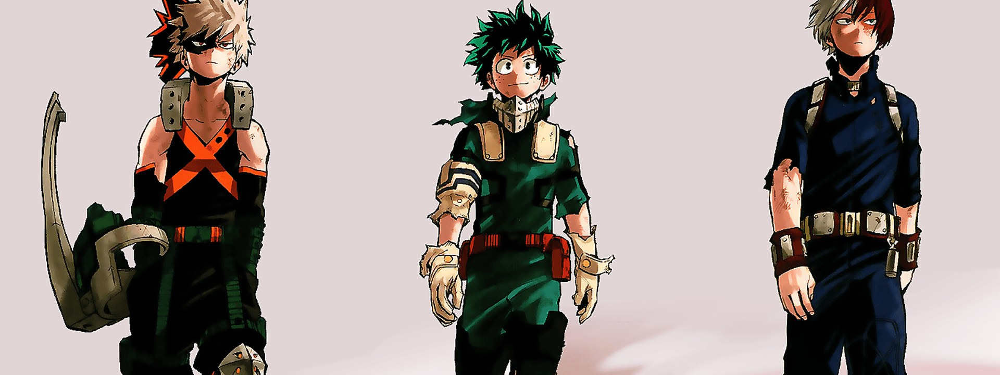

# Boku no Hero Academia

<!-- HERO:START -->

{ .hero-img }

<!-- HERO:END -->

=== "Spotify"
    <iframe src="https://open.spotify.com/embed/playlist/7AVUmaysWTGhaNcxSdEaus" title="Spotify playlist player" allow="autoplay; clipboard-write; encrypted-media; fullscreen; picture-in-picture" loading="lazy" class="anison-embed"></iframe>
    
    

    [▶ Abrir en Spotify](https://open.spotify.com/playlist/7AVUmaysWTGhaNcxSdEaus){ .md-button .md-button--primary }
    

=== "YouTube"
    <iframe src="https://www.youtube.com/embed/videoseries?list=PLvZvtO-L5oh53-Nkv5oU_NHkzLV255Ipq&rel=0" title="YouTube playlist player" allow="accelerometer; autoplay; clipboard-write; encrypted-media; gyroscope; picture-in-picture; web-share" allowfullscreen loading="lazy" class="anison-embed"></iframe>
    
    

    [▶ Abrir en YouTube](https://www.youtube.com/playlist?list=PLvZvtO-L5oh53-Nkv5oU_NHkzLV255Ipq){ .md-button }
    

