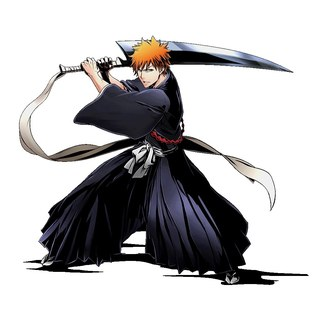

# B

-   [{ width=200 }](baki.md)

    **[Baki](baki.md)**

-   [{ width=200 }](banana-fish.md)

    **[Banana Fish](banana-fish.md)**

-   [{ width=200 }](black-butler.md)

    **[Black Butler](black-butler.md)**

-   [{ width=200 }](black-clover.md)

    **[Black Clover](black-clover.md)**

-   [{ width=200 }](bleach.md)

    **[Bleach](bleach.md)**

-   [{ width=200 }](blue-box.md)

    **[Blue Box](blue-box.md)**

-   [{ width=200 }](blue-lock.md)

    **[Blue Lock](blue-lock.md)**

-   [{ width=200 }](bocchi-the-rock.md)

    **[Bocchi the Rock](bocchi-the-rock.md)**

-   [{ width=200 }](boku-no-hero-academia.md)

    **[Boku no Hero Academia](boku-no-hero-academia.md)**

-   [{ width=200 }](boruto.md)

    **[Boruto](boruto.md)**

-   [{ width=200 }](bungo-stray-dogs.md)

    **[Bungo Stray Dogs](bungo-stray-dogs.md)**

